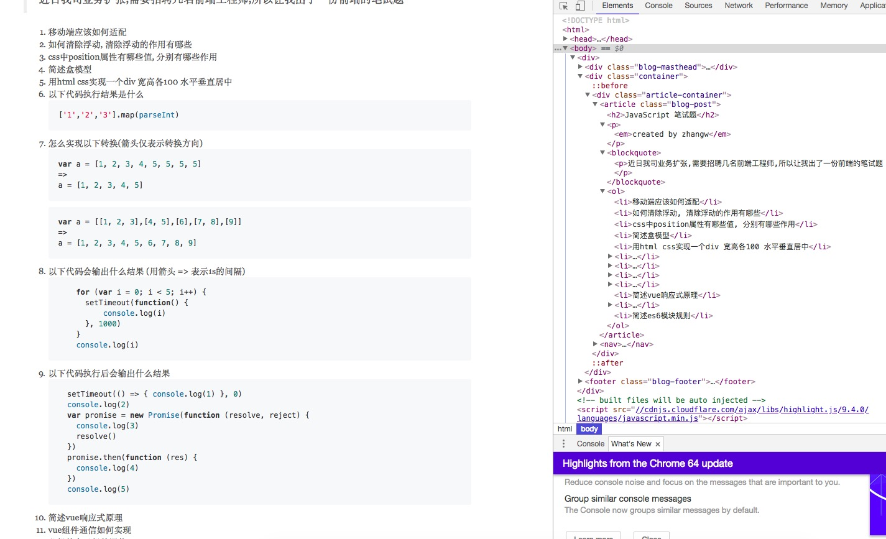

## 没有服务器的时候怎么搭建一个自己的博客 (上)
*created by zhangw*
> 一直以来都想搭建一个自己的博客, 但是刚好不久前阿里云的试用半年的服务器到期了..., 也一直没找到物美价廉(乞丐版)的服务器, emmmmm...但是博客还得搭呀, 所以就试着用Vue和Github Page搭建一个博客

### 分析部分
搭建一个博客的必要条件 = 一个域名 + 一个服务器 + 博客前端
刚好域名和服务器 Github page 都解决了,虽然不能部署服务程序, 但是对于搭建博客来说, 部署前端文件其实也就够了
博客的形式当然是选择markdown啦
### Github Page
Github Page官方的描述是
> Websites for you and your projects. Hosted directly from your GitHub repository. Just edit, push, and your changes are live.

就是github为开发者提供的一个展示个人或项目的网站。Github page其实是一个会提供一个github.io域名的文件服务器。你可以在上面放任何你想要展现的东西。
#### 创建Github Page
1. 在你的github仓库创建一个名称为 yourGithubId.github.io 的仓库, (把YourGithubId改成你自己的github id即可, 例如 only4ly.github.io)
2. 把你的仓库clone下来
   ``` bash
   git clone https://github.com/only4ly/only4ly.github.io.git
   ```
3. 用编辑器打开你克隆下来的项目,创建 index.html 
4. 把你的项目重新提交到github
   ``` bash
   cd only4ly.github.io
   git commit -am 'init blog'
   git push origin master
   ```
5. 成功之后, 用浏览器打开 yourGithubId.github.io, 不出意外, 你就可以看到所创建的index.html的内容了
### 搭建Blog项目
#### 用Vue-cli搭建Vue+Typescript
GitHub Page 搞定了之后就可以搭建项目了, 由于是个人项目, 所以当然是本着折腾的精神选择了Vue+Typescript
``` bash
cd projects
// vue-cli 已集成typescript的模板 其余步骤和正常搭建项目一样~
vue init SimonZhangITer/vue-typescript-template vue-ts-blog
cd vue-ts-blog
npm install
npm run dev
```
#### 解析.md文件(核心步骤)
我使用的是 vue-markdown-loader, 一个可以把markdown文件解析成vue组件的一个webpack-loader, github仓库如下, 感谢大神！
https://github.com/QingWei-Li/vue-markdown-loader
1. 安装 vue-markdown-loader
``` bash
  npm i vue-markdown-loader -D
```

2. 在build文件夹中的webpack.base.conf.js的module.rules添加如下规则
``` javascript
  module: {
    rules: [
      ...
      // 添加以下代码
      {
        test: /\.md$/,
        loader: 'vue-markdown-loader',
        options: {
          wrapper: 'article'
        }
      },
      // 截止
      ...
    ]
  }
```

3. 由于是typescript语法, 虽然markdown文件可以被解析成vue的组件, 但是作为模块引入的时候, typescript是无法识别的, 所以要添加相应的.d.ts文件, 使typescript可以识别.md文件, 在src/typings 添加 markdown.d.ts 文件, 添加如下代码
``` javascript
// 使typescript将.md文件作为vue对象引入
declare module "*.md" {
  import Vue from 'vue'
  export default Vue
}
```
然后, 你就可以将.md文件作为一个vue组件引入(就像一个.vue单文件组件一样)
eg: 
``` javascript
<template>
  <Blog />
</template>
<script lang="ts">
import Vue from 'vue'
import Component from 'vue-class-component'
import Blog from '@/articles/blog.md'

@Component({
  components: {
    Blog
  }
})
export class FeatureComponent extends Vue {}
</script>
```
效果如下 (ps: 我的效果是加过css美化之后的效果)

<!--  -->
### 结束
ok 到这一步, 我们就已经初步完成项目的搭建并且成功的解析了markdown文件。
下一篇我们将一起完成这个简单的项目。